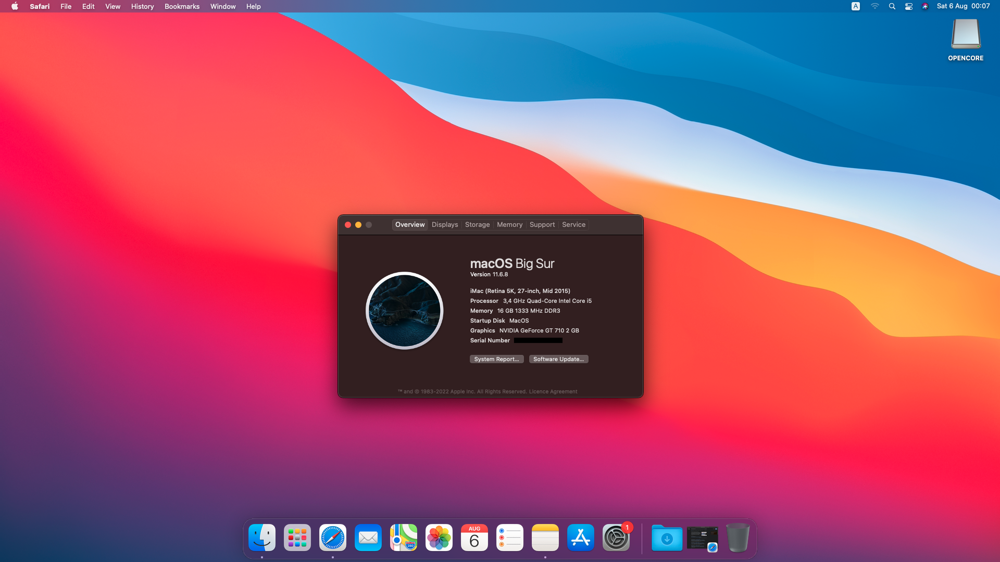

### H61M-P31(G3) Hackintosh Build

| Specifications | Detail                                            |
| ------------------- | ------------------------------------------- |
| Motherboard | MSI H61M-P31(G3) |
| Processor | Intel Core i5-3570 |
| Memory | 8GB*2 Kingston DDR3 1333MHz |
| iGPU | Intel HD Graphics 2500 |
| dGPU | NVIDIA GeForce GT 710 G208 Kepler |
| Sound | Realtek ALC887 |
| Ethernet | Realtek 8111E |
| Hard Disk | WD Green SATA SSD |
| Bootloader | OpenCore |
| Tested macOS versions | Big Sur, Ventura|

### Tools

* [MountEFI](https://github.com/corpnewt/MountEFI)
* [ProperTree](https://github.com/corpnewt/ProperTree)
* [ssdtPRGen.sh](https://github.com/Piker-Alpha/ssdtPRGen.sh)
